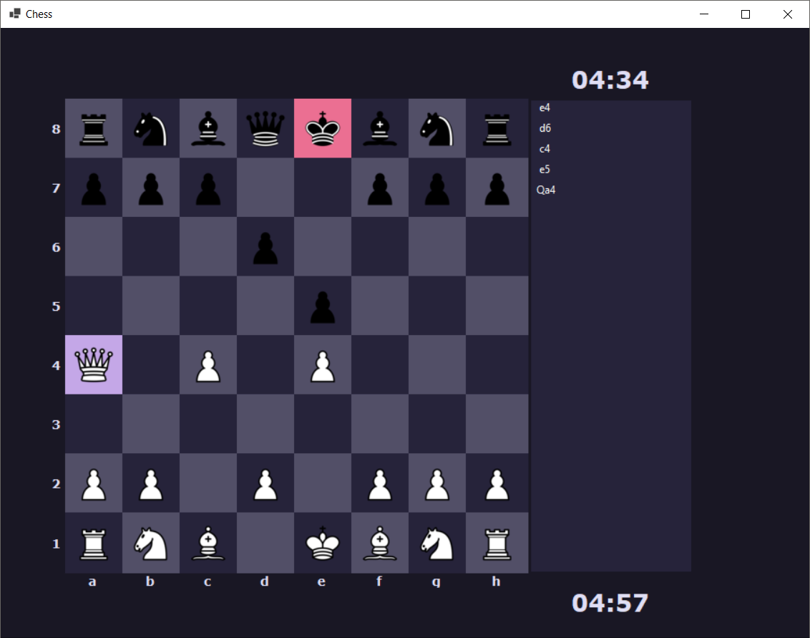
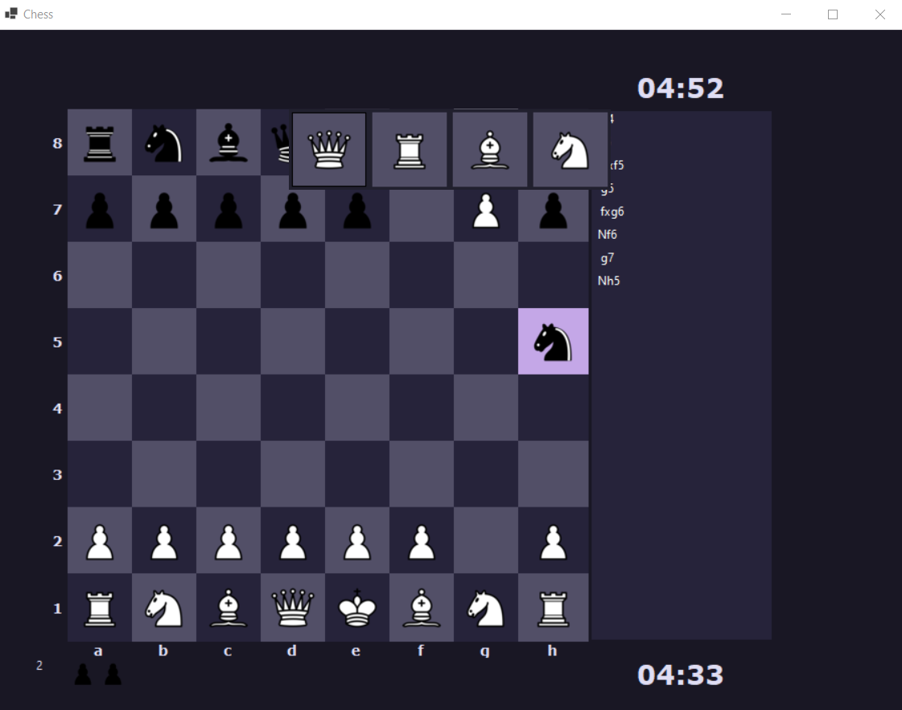

# User documentation

The game follows the standard chess rules [wikipedia](https://en.wikipedia.org/wiki/Rules_of_chess?useskin=vector) | [chess.com](https://www.chess.com/learn-how-to-play-chess)

Controls are click-to-click, meaning you click a piece you wish to move with and then click on a viable chessboard tile to move the piece.\
If a game is declared as over for whatever reason (mate, stalemate, draw, time out), you will get a pop up with the relevant information

Then you can choose if you want to play again, or exit the application.

In the left corner of the screen you can see a material value written for the player that's leading. Above or below the chessboard are displayed pieces that were taken already and on the right are player specific timers and a list of moves written in algebraic notation.

Other relevant screenshots:

Move preview:

Last move:

King under check:

Promotion option:

